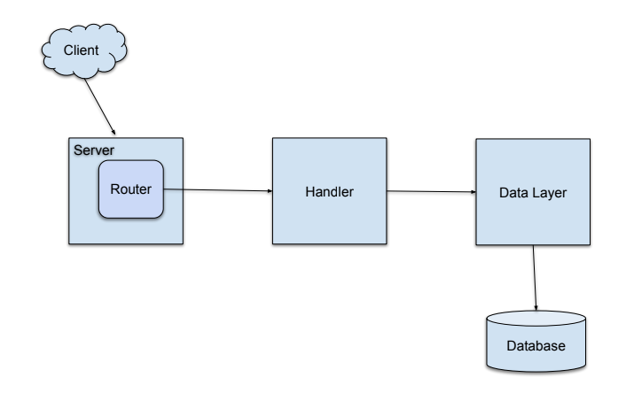

# Product REST API Project
Go (or Golang) has become a popular choice for building high-performance, concurrent, and scalable web services. Its simplicity, strong standard library, and efficiency make it an excellent language for creating REST APIs.

In this guide, we will walk through the process of building a REST API in Go from the ground up. We will cover the core concepts, project structure and practical examples for implementing a simple Product API.

We will be building a SQL-backed REST API for performing CRUD operations. The diagram below represents the architecture we will be following during the development process.

## Core Concepts & Architecture
Before diving into code, it's important to understand the main components of a Go-based REST API.
- **Server:** The core of the application that listens to incoming requests on a specific port. In go, you typically use the net/http package to create an HTTP server.
- **Router:** A multiplexer that inspects the incoming request's URL and HTTP methods. It then forwards the request to the appropriate handler function. Popular choices include the standard library's http.ServerMux or more feature-rich third-party packages like gorilla/mux.
- **Handlers:** These are the functions that do the actual work. A handler receives the HTTP request, processes it(e.g., by interacting with a database), and writes a HTTP response back to the client. Typically, each API endpoint(like /products or /products/{id}) will have its own handler.
- **Models:** These are go structs that define the structure of your application's data. For example, in the Product REST API, a Product struct would define a product item.
- **Data Layer:** This is the part of the application that interacts with the database(e.g. PostgreSQL, MongoDB, or even an in-memory store). It handles the logic for creating, reading, updating, and deleting (CRUD) data. There are several architectural patterns for implementing the datalayer such as `Clean Architecture`, `Repository Pattern`, e.t.c. In this project, our implementation we make use of the repository pattern to write and read data from a postgres database. It's fairly simple to implement and manage especially for people who are new in this area.
